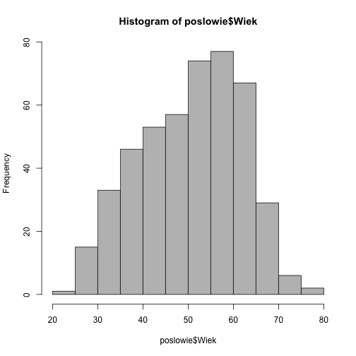
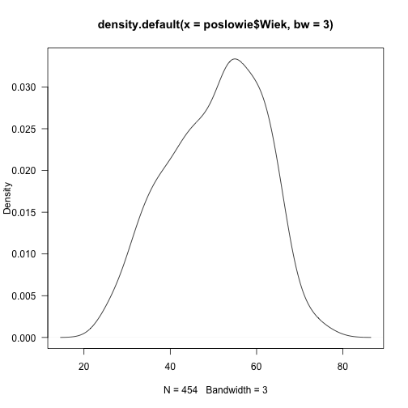

# Jak badać rozkład jednej zmiennej?

W tym rozdziale przedstawimy podstawowe narzędzia analizy rozkładu zmiennych ilościowych i jakościowych.
Wykorzystamy do tego bazę danych dotyczących posłów z 8 kadencji Sejmu.
Dane pobierane są bezpośrednio z Internetu z serwisu GitHub.


```r
poslowie <- archivist::aread("pbiecek/Przewodnik/arepo/07088eb35cc2c9d2a2a856a36b3253ad")

head(poslowie)
```

```
##   Glosow                   Klub  Wyksztalcenie                      Zawod
## 1  10500 Prawo i Sprawiedliwość         wyższe              poseł na Sejm
## 2  18514 Prawo i Sprawiedliwość         wyższe           parlamentarzysta
## 3   7275  Platforma Obywatelska         wyższe         agroprzedsiębiorca
## 4  15668               Kukiz'15         wyższe specjalista ds. medialnych
## 5  12021 Prawo i Sprawiedliwość         wyższe           poseł na Sejm RP
## 6   7935               Kukiz'15 średnie ogólne                dziennikarz
##          ImieNazwisko DataUrodzenia MiejsceUrodzenia  Wiek
## 1     Adam Abramowicz    1961-03-10   Biała Podlaska 55.01
## 2    Andrzej Adamczyk    1959-01-04      Krzeszowice 57.19
## 3    Zbigniew Ajchler    1955-11-21        Szamotuły 60.32
## 4 Adam Andruszkiewicz    1990-06-30          Grajewo 25.69
## 5     Waldemar Andzel    1971-09-17          Czeladź 44.48
## 6          Piotr Apel    1984-02-08         Warszawa 32.08
```

## Zmienna ilościowa

W zbiorze danych `poslowie` mamy kilka zmiennych ilościowych. 

Czy potrafisz je wskazać? 

Z pewnością należą do nich `Wiek` i `Glosow`. 

### Średnia

Jaki jest średni wiek posłów?

$$
\bar x = \sum_{i=1}^n x_i / n.
$$


```r
mean(poslowie$Wiek)
```

```
## [1] 50.36813
```

### Średnia Windsorowska

A średnia obcięta, wyznaczona na podstawie 60\% środkowych obserwacji?


```r
mean(poslowie$Wiek, trim=0.2)
```

```
## [1] 51.01785
```

### Mediana

Mediana bliska średniej, czyżby brak skośności?


```r
median(poslowie$Wiek)
```

```
## [1] 51.87
```

### Odchylenie standardowe

Odchylenie standardowe zmiennej wiek.

$$
\bar \sigma = \sqrt{sum_{i=1}^n (x_i - \bar x)^2 / (n-1)}
$$


```r
sd(poslowie$Wiek)
```

```
## [1] 11.03323
```

### Rozstęp

Jaka jest najmniejsza i największa wartość przyjmowana przez zmienną Wiek?


```r
range(poslowie$Wiek)
```

```
## [1] 23.50 77.53
```

### Rozstęp kartylowy

Ile wynosi rozstęp kwartylowy (różnica pomiędzy 3. a 1. kwartylem)?


```r
IQR(poslowie$Wiek)
```

```
## [1] 17.195
```

### Kurtoza / miara spłaszczenia

Aby ją wyznaczyć potrzebujemy pakietu `e1071`.

Kurtozę można liczyć na kilka sposobów. 

Typ: 1

$$
g_2 = m_4 / m_2^2 - 3.
$$

Typ: 2 (domyślny w SAS i SPSS), nieobciążony estymator kurtozy dla r. normalnego.

$$
G_2 = ((n+1) g_2 + 6) * (n-1) / ((n-2)(n-3))
$$

Typ: 3 (domyślny w R)

$$
b_2 = m_4 / s^4 - 3 = (g_2 + 3) (1 - 1/n)^2 - 3.
$$

Więcej o porównaniu tych estymatorów *D. N. Joanes and C. A. Gill (1998), Comparing measures of sample skewness and kurtosis. The Statistician, 47, 183–189.*


```r
library(e1071)
kurtosis(poslowie$Wiek)
```

```
## [1] -0.7078222
```

### Skośność

Przyjmując $$m_r = ∑_i (x_i - mu)^r / n$$

Typ: 1

$$
g_1 = m_3 / m_2^(3/2)
$$

Typ: 2 (domyślny w SAS i SPSS),

$$
G_1 = g_1 * sqrt(n(n-1)) / (n-2).
$$

Typ: 3 (domyślny w R)

$$
b_1 = m_3 / s^3 = g_1 ((n-1)/n)^(3/2).
$$

Wszystkie trzy estymatory są nieobciążone dla modelu normalnego.


```r
skewness(poslowie$Wiek)
```

```
## [1] -0.2292414
```


### Kwantyle

Wybrane kwantyle zmiennej wiek.

W pakiecie R zaimplementowanych jest 9 różnych metod liczenia kwantyli, zobacz argument type.


```r
quantile(poslowie$Wiek, c(0.1, 0.25, 0.5, 0.75, 0.9))
```

```
##    10%    25%    50%    75%    90% 
## 34.586 42.025 51.870 59.220 63.864
```

### Odchylenie medianowe

Odchylenie medianowe

$$
mad = 1.4826 * median(abs(x - median(x)))
$$

Stała $$1.4826 \approx 1/ \Phi^(-1)(3/4)$$ jest wybrana by wartość oczekiwana była równa odchyleniu standardowemu dla modelu normalnego.


```r
mad(poslowie$Wiek)
```

```
## [1] 12.39454
```

### Najwazniejsze statystyki


```r
summary(poslowie$Wiek)
```

```
##    Min. 1st Qu.  Median    Mean 3rd Qu.    Max. 
##   23.50   42.02   51.87   50.37   59.22   77.53
```

### Histogram


```r
hist(poslowie$Wiek, col="grey")
```


### Dystrybuanta empiryczna


```r
plot(ecdf(poslowie$Wiek), las=1)
```



### Jądrowy estymator gęstości


```r
plot(density(poslowie$Wiek, bw=1), las=1)
```


```r
plot(density(poslowie$Wiek, bw=3), las=1)
```



## Zmienna jakościowa


- dla zmiennych ciągłych, dyskretnych, ciągłych z atomem
- estymator jądrowy gęstości (histogram)
- ecdf
- testy zgodności
