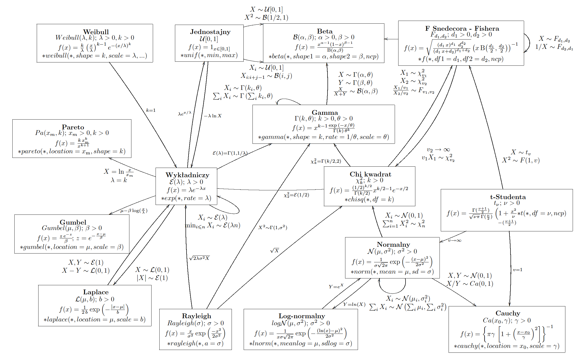
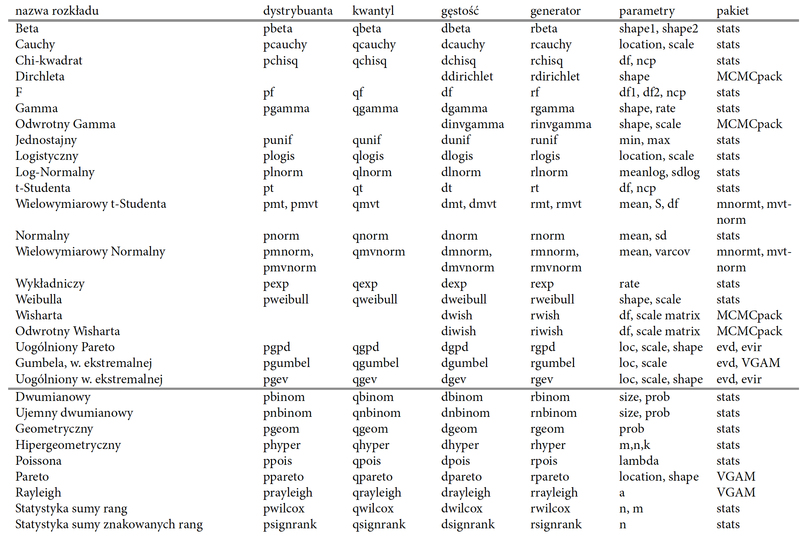
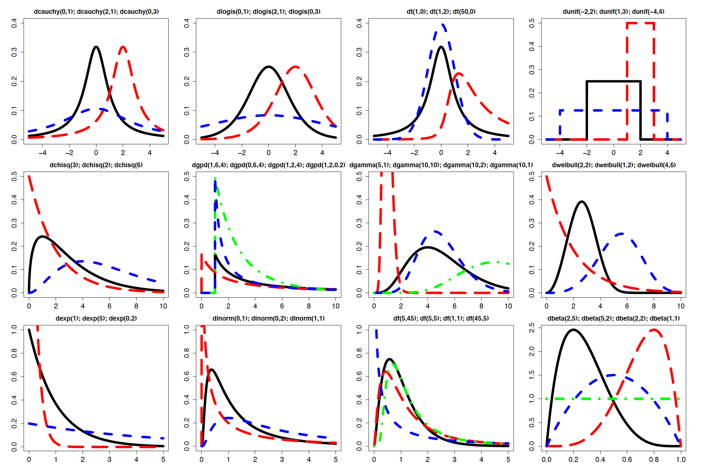
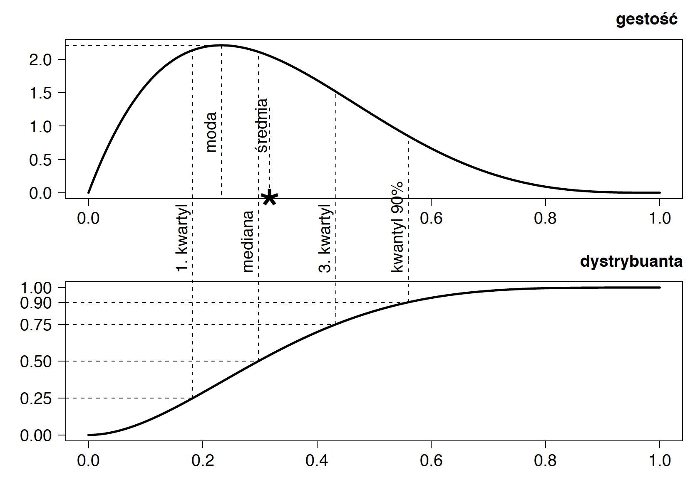
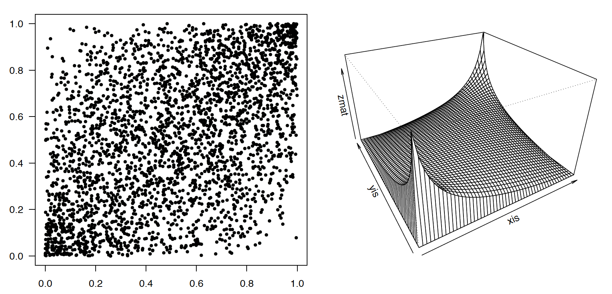
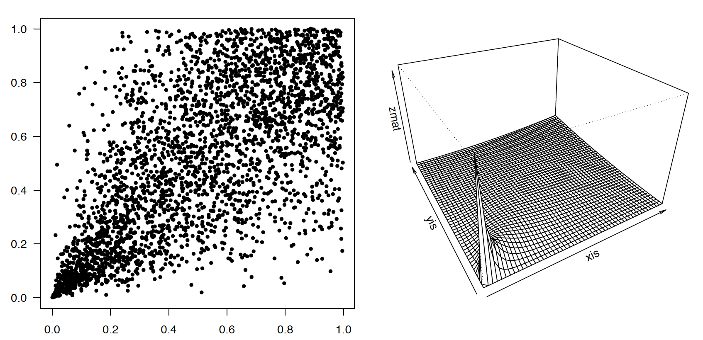
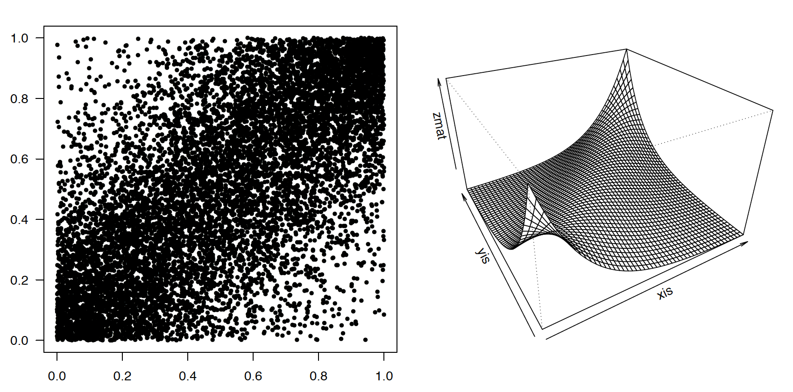
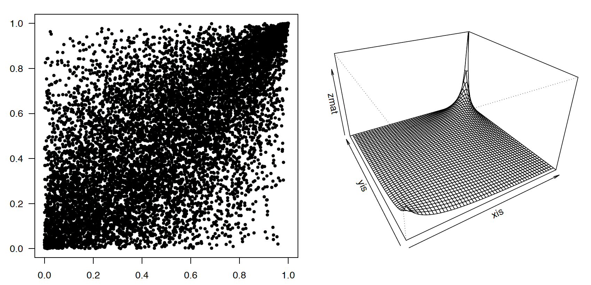
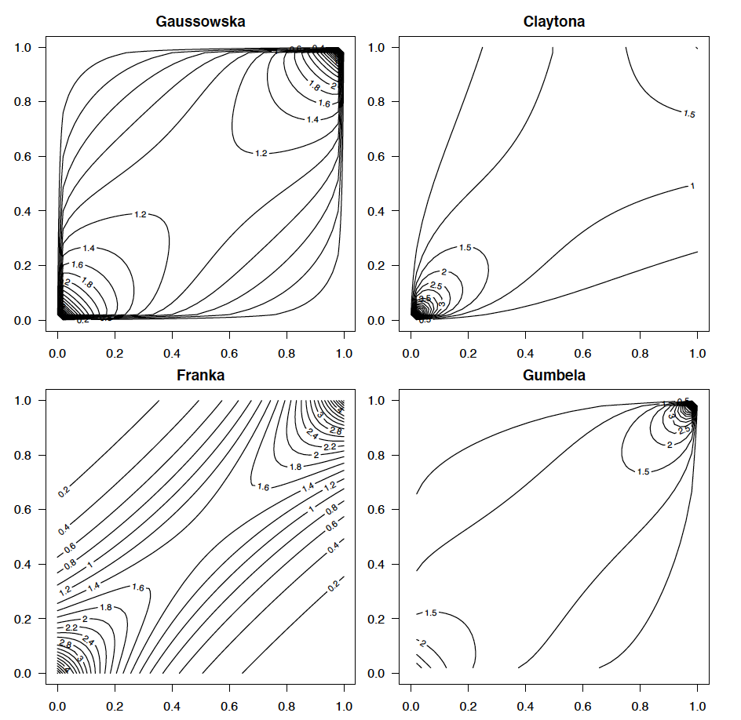
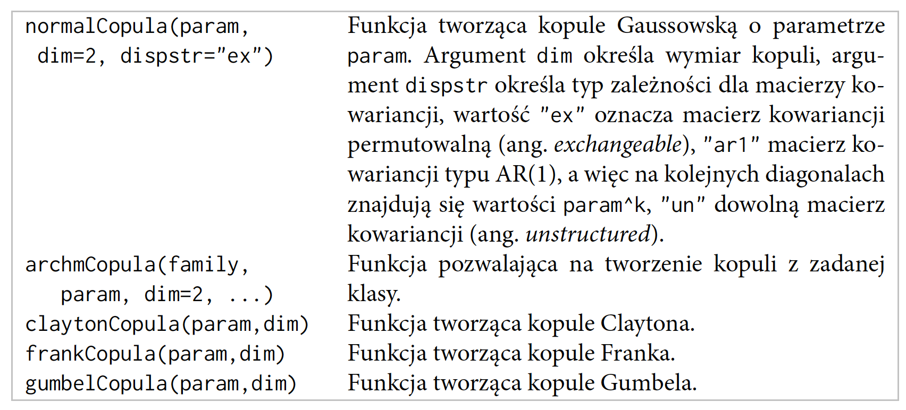

# Jak generować liczby losowe?

W wielu zagadnieniach, szczególnie tych związanych z modelowaniem metodami Monte Carlo bardzo złożonych zjawisk rzeczywistych (finansowych, biologicznych, fizycznych, chemicznych, meteorologicznych itp.), potrzebne są narzędzia pozwalające emulować losowość, tak aby odzwierciedlić stochastyczną naturę badanego zjawiska.
Dlatego też w wielu pakietach statystycznych oraz bibliotekach różnych języków programowania dostępne są funkcje do generowania liczb pseudolosowych, czyli liczb o właściwościach podobnych do prawdziwie losowych. 

Takie funkcje dostępne są również w programie R. W tym podrozdziale opiszemy podstawowe zagadnienia związane z generatorami liczb losowych, a w następnym podrozdziale przedstawimy funkcje do generowania liczb losowych z różnych popularnych rozkładów oraz do wyznaczania charakterystyk tych rozkładów.

Btw: Za autora metody Monte Carlo uznaje się polskiego matematyka Stanisława Ulama, który współpracując w Los Alamos z Enrico Fermim, John von Neumannem i Nicholasem Metropolisem, użył tej metody do modelowania reakcji łańcuchowej przebiegającej podczas wybuchu bomby wodorowej.

## Wprowadzenie do generatorów liczb pseudolosowych

Generowane przez komputer liczby nazywane są pseudolosowymi, ponieważ mają emulować losowość, ale są wyznaczane  w deterministyczny, choć często bardzo skomplikowany, sposób. Z uwagi na nieustannie rosnące zapotrzebowanie na dobre liczby pseudolosowe w literaturze opisanych jest wiele metod ich generowania, a nad nowymi metodami wciąż pracuje wiele osób.

W programie R mamy możliwość wyboru jednego z już zaimplementowanych algorytmów generujących liczby losowe lub napisania własnej funkcji do generowania tych liczb. Aktualnie w pakiecie `base` zaimplementowanych jest sześć algorytmów generowania liczb losowych. 

Zmienić generator liczb losowych można wywołując funkcję `RNGkind()` oraz podając za jej argumenty nazwy dwóch wybranych generatorów, odpowiednio dla rozkładu jednostajnego i dla rozkładu normalnego. Wynikiem tej funkcji są nazwy uprzednio używanych generatorów.

Do generowania liczb z rozkładu jednostajnego dostępne są następujące nazwy algorytmów: `"Wichmann-Hill"`, `"Marsaglia-Multicarry"`, `"Super-Duper"`, `"Mersenne-Twister"`, `"Knuth-TAOCP"`, `"Knuth-TAOCP-2002"`, `"user-supplied"`. Domyślnie stosowany jest `"Mersenne-Twister"`. 

Liczby losowe dla innych rozkładów można otrzymać z liczb losowych dla rozkładu jednostajnego wykorzystując np. metodę odwrotnej dystrybuanty. Nie ma więc potrzeby określania generatora dla każdego rozkładu oddzielnie. Wyjątkiem jest rozkład normalny, dla którego mamy możliwość wybrania metody generowania liczb losowych. Dostępne metody oznaczone są nazwami: 
`"Kinderman-Ramage"`, `"Buggy Kinderman-Ramage"`, `"Ahrens-Dieter"`, `"Box-Muller"`, `"Inversion"`, `"user-supplied"`. Domyślnie wykorzystywana jest metoda odwrotnej dystrybuanty `"Inversion"`. 


Ponieważ dystrybuanta rozkładu normalnego nie ma prostej postaci analitycznej, więc aby użyć metody odwrotnej dystrybuanty trzeba wykorzystać zaawansowane i wymagające obliczeniowo aproksymacje numeryczne, których opis można znaleźć w opisie funkcji `qnorm()`. Innym popularnym algorytmem generowania liczb z rozkładu normalnego, znacznie szybszym od metody odwrotnej dystrybuanty, jest algorytm Boxa-Mullera (`"Box-Muller"`). 

Więcej informacji o tym i innych generatorach przeczytać można w dokumentacji do funkcji `RNGkind()`.
Osoby zainteresowane tym tematem znajdą więcej informacji o generatorach w książce \cite{Zielinski}. Poniżej przedstawiamy przykład użycia funkcji `RNGkind()` do zmiany generatora.

Wybieramy generator "Super-Duper" dla generowania liczb z rozkładu jednostajnego i metodę "Box-Muller" do generowania liczb z rozkładu normalnego, wynikiem funkcji RNGkind() są poprzednio stosowane generatory.


```r
(RNGkind("Super", "Box")) 
```

```
## [1] "Mersenne-Twister" "Inversion"
```

Można wybierać generatory podając tylko pierwsze znaki nazw.


```r
(RNGkind("Super", "Ahr"))
```

```
## [1] "Super-Duper" "Box-Muller"
```

Generator to funkcja deterministyczna. Do losowania kolejnych liczb wykorzystuje tzw. ziarno (ang. *seed*), całkowicie determinujące wartości kolejnych liczb pseudolosowych. Ziarno to wartość na podstawie której konstruowane będą kolejne liczby losowe.

Dla ustalonego generatora i ziarna generowane będą identyczne liczby losowe bez względu na system operacyjny, nazwę komputera, rasę użytkownika, czy temperaturę w pokoju. 

Tę właściwość programowych generatorów liczb pseudolosowych (istnieją też sprzętowe generatory, ale to osobny temat) można łatwo wykorzystać! Sterując wyborem ziarna umożliwiamy otrzymywanie identycznych ciągów liczb losowych na różnych komputerach. W ten sposób możemy powtarzać wyniki symulacji, odtwarzać te wyniki na innych komputerach lub kontynuować obliczenia przerwane w wyniku wystąpienia jakiegoś błędu. 

Ciekawe informacje dotyczące jakości generatorów liczb pseudolosowych znaleźć można w dokumentacji pakietu `RDieHarder` lub na stronie `http://dirk.eddelbuettel.com/code/rdieharder.html`.

Informacje o ziarnie i generatorze liczb losowych przechowywana jest w wektorze `.Random.seed`. Pierwszym elementem tego wektora jest informacja, który generator jest wykorzystywany, pozostałe elementy przechowują ziarno generatora. Dla generatora `Mersenne-Twister` ziarno jest wektorem 625 liczb całkowitych, dla pozostałych generatorów ziarno ma inną, zwykle krótszą, długość. Poniżej przykład zapisywania i odtwarzania ziarna generatora.


```r
.Random.seed[1:7]
```

```
## [1]        102 2077933671  173559165         NA         NA         NA
## [7]         NA
```

Zapisujemy ziarno generatora, losujemy 10 liczb losowych.


```r
save.seed <- .Random.seed
rnorm(9)
```

```
## [1]  0.02310766 -2.72028648  0.80841874 -0.03450949 -1.22738477  0.53013949
## [7]  0.06613156 -0.35526203  1.49315523
```

Odtwarzamy ziarno i losujemy 10 kolejnych liczb.


```r
.Random.seed <- save.seed 
rnorm(9)
```

```
## [1]  1.04741743 -1.55617842  0.64502272  0.75880054 -0.03490370 -0.09501018
## [7]  1.07600818  0.15361756  1.00753367
```

Pamiętanie ziarna złożonego z 625 liczb nie jest specjalnie wygodne. Do łatwej inicjacji ziarna zalecane jest korzystanie z funkcji `set.seed()`. Argumentem tej funkcji jest jedna liczba, która jest zamieniana na ziarno odpowiedniej długości. Poniżej przykład wywołania tej funkcji. Ustawiamy ziarno i generujemy liczby losowe.


```r
set.seed(1313)
runif(10)
```

```
##  [1] 0.27578588 0.06637362 0.82379757 0.52979504 0.91424061 0.51159113
##  [7] 0.94690240 0.56341309 0.61462777 0.54047574
```

Inicjujemy to samo ziarno.


```r
set.seed(1313)
runif(10)
```

```
##  [1] 0.27578588 0.06637362 0.82379757 0.52979504 0.91424061 0.51159113
##  [7] 0.94690240 0.56341309 0.61462777 0.54047574
```

## Popularne rozkłady zmiennych losowych

W programie R dostępnych jest wiele funkcji do obsługi większości popularnych i wielu mniej popularnych rozkładów zmiennych losowych. W tym podrozdziale skupimy się na jednowymiarowych zmiennych losowych. Osoby poszukujące generatorów zmiennych wielowymiarowych z pewnością zainteresuje pakiet `copula`.
Nazewnictwo funkcji związanych ze zmiennymi losowymi jest zestandaryzowane. Nazwy funkcji składają się z dwóch członów, opisanych na poniższym schemacie.

Schemat nazw funkcji związanych z rozkładami zmiennych losowych.

```
[prefix][nazwa.rodziny.rozkładów]()
```

Poniżej w kolejnych liniach losujemy pięć liczb z rozkładu jednostajnego. Wyznaczamy wartość dystrybuanty rozkładu jednostajnego w punkcie 0.5. Wyznaczamy wartość gęstości rozkładu jednostajnego w punkcie 0.5. Wyznaczamy wartość kwantyla rozkładu jednostajnego rzędu 0.1.


```r
runif(5)        
```

```
## [1] 0.7338347 0.1627882 0.1364178 0.4895255 0.6499082
```

```r
punif(0.5)        
```

```
## [1] 0.5
```

```r
dunif(0.5)         
```

```
## [1] 1
```

```r
qunif(0.1)
```

```
## [1] 0.1
```

Suffix `nazwa.rodziny.rozkładów` określa jakiej rodziny rozkładów dana funkcja dotyczy. Wszystkich rodzin rozkładów dostępnych w programie R jest wiele, przegląd popularniejszych znajduje się w poniższej tabeli. `Prefix` jest jednoliterowym markerem, określającym co chcemy z tym rozkładem zrobić. `Prefix` może być jedną z liter:

* Litera `r` (jak **r**andom) rozpoczyna nazwę funkcji - generatora liczb losowych. Taka funkcja generuje próbę prostą o liczebności `n` (pierwszy argument funkcji) z określonego rozkładu. 
* Litera `p` (jak **p**robability) rozpoczyna nazwę funkcji wyznaczającej wartości dystrybuanty danego rozkładu w punktach określonych przez wektor `x` (pierwszy argument tych funkcji).
* Litera `d` (jak **d**ensity) rozpoczyna nazwę funkcji wyznaczającej wartości gęstości (dla rozkładów ciągłych) lub prawdopodobieństwa (dla rozkładów dyskretnych) danego rozkładu w punktach określonych przez wektor `x` (pierwszy argument tych funkcji).
* Litera `q` (jak **q**uantile) rozpoczyna nazwę funkcji wyznaczającej wartości kwantyli danego rozkładu w punktach `q` (pierwszy argument tych funkcji). 


Pozostałe argumenty tych funkcji określają parametry rozkładu w wybranej rodzinie rozkładów. Dla funkcji wyznaczających gęstość lub dystrybuantę można określić argument  `log.p`. Jeżeli argumentem jest `log.p=TRUE`, to wynikiem funkcji są logarytmy zamiast oryginalnych wartości. Operowanie na logarytmach z gęstości w pewnych sytuacjach możne zmniejszyć błędy numeryczne. 









Przykładowo licząc logarytm funkcji wiarygodności zamiast liczyć logarytm z iloczynu gęstości, bardziej dokładne wyniki otrzymamy dodając logarytmy z poszczególnych wartości gęstości. 

Listę funkcji stowarzyszonych do najpopularniejszych rozkładów zmiennych losowych znaleźć można w powyższej tabeli.
Jednym z najbardziej znanych rozkładów zmiennych losowych jest rozkład normalny, nazywany też rozkładem Gaussa. Na powyższym rysunku  przedstawiona jest gęstość i dystrybuanta standardowego rozkładu normalnego. Wykres został wygenerowany przez następujące polecenia (zwróć uwagę jak uzyskano podwójne osie Y).

W poniższym przykładzie w pierwszej linii wybieramy punkty, w których wyznaczymy gęstość i dystrybuantę. Następnie rysujemy gęstość. 


```r
x <- seq(-4,4,by=0.01)
plot(x, dnorm(x), type="l", lwd=3, cex.axis=1.5, cex.lab=1.5) 
```


Na tym samym rysunku chcemy narysować dystrybuantę. Wymaga to użycia innej osi OY, dlatego zmieniamy współrzędne w wyświetlanym oknie graficznym. Teraz oś Y ma przyjmować wartości od -0.04 do 1.04. 


```r
par(usr=c(-4,4,-0.04,1.04))
```

Dorysowujemy dystrybuantę, teraz współrzędne są już w nowym układzie. 


```r
lines(x, pnorm(x), lty=2, lwd=3, cex.axis=1.5, cex.lab=1.5)   
```

```
## Error in plot.xy(xy.coords(x, y), type = type, ...): plot.new has not been called yet
```

Dodajemy oś OY po prawej stronie, współrzędne w nowym układzie.


```r
axis(side=4, cex.axis=1.5, cex.lab=1.5)                    
```

```
## Error in axis(side = 4, cex.axis = 1.5, cex.lab = 1.5): plot.new has not been called yet
```

```r
mtext(side=4, "pnorm()", line=2.5, cex.axis=1.5, cex=1.5)
```

```
## Error in mtext(side = 4, "pnorm()", line = 2.5, cex.axis = 1.5, cex = 1.5): plot.new has not been called yet
```


Funkcje z pakietu `stats` do generowania liczb i wyznaczania charakterystyk z rozkładu normalnego to `pnorm()`, `dnorm()`, `qnorm()` i `rnorm()`. Poniżej przedstawiamy ich deklaracje. Funkcje dla innych rozkładów mają bardzo podobne deklaracje z dokładnością do nazwy parametrów rozkładów.

```
dnorm(x, mean=0, sd=1, log = FALSE)
pnorm(q, mean=0, sd=1, lower.tail = TRUE, log.p = FALSE)
qnorm(p, mean=0, sd=1, lower.tail = TRUE, log.p = FALSE)
rnorm(n, mean=0, sd=1)
```


Rozkład normalny opisywany jest dwoma parametrami: średnią i odchyleniem standardowym. Standardowy rozkład normalny ma średnią równą 0 i odchylenie standardowe równe 1, są to też domyślne wartości argumentów `mean` i `sd`. Zmiana argumentu `lower.tail=TRUE` powoduje, że dystrybuanta liczona jest jako $$P(X \leq x)$$, gdy argument `lower.tail=FALSE`, to wyznaczana jest wartość $P(X > x)$, czyli dopełnienie dystrybuanty. 

Zgodnie z regułą ,,trzy sigma'' prawdopodobieństwo, że zmienna losowa o standardowym rozkładzie normalnym przyjmie wartość mniejszą od -3 lub większą od 3 jest bardzo małe. Jeżeli pamiętamy czym jest dystrybuanta oraz wiemy, że wartości dystrybuanty w programie R wyznaczyć można funkcją `pnorm()`, to z łatwością wyznaczymy ww. prawdopodobieństwo.

Prawdopodobieństwo wylosowania normalnego wartości $$> 3$$ lub $$< -3$$.


```r
pnorm(-3) + (1 - pnorm(3))  
```

```
## [1] 0.002699796
```

Wartość gęstości rozkładu normalnego w punktach $$-1$$, $$0$$ i $$1$$.


```r
dnorm(-1:1, mean=0, sd=1)
```

```
## [1] 0.2419707 0.3989423 0.2419707
```


Najpopularniejsze kwantyle rozkładu normalnego.


```r
qnorm(c(0.001, 0.025, 0.05, 0.5, 0.95, 0.975, 0.999))
```

```
## [1] -3.090232 -1.959964 -1.644854  0.000000  1.644854  1.959964  3.090232
```

Poniżej pokażemy jak wylosować dziesięć liczb z rozkładu normalnego o średniej 2 i odchyleniu stndardowym równym 1.


```r
rnorm(10, mean = 2, sd = 1)
```

```
##  [1]  1.36302924  1.63030216 -0.02528017  3.19469911  0.91553561
##  [6]  2.07589592  1.68723109  2.52672495  1.45562343  3.24331153
```

Oba argumenty, zarówno średnia jak i odchylenie standardowe mogą być wektorami.


```r
rnorm(10, mean = 1:10, sd=1:10)
```

```
##  [1]  1.0029785  0.2818232  2.5886568  5.0915514  1.5614802  9.7741237
##  [7] 12.2775071 -7.7713310 13.8131033  5.7068155
```

Z pozostałych rozkładów korzysta się równie prosto.
Na powyższym rysunku przedstawiono przykładowy rozkład ciągłej zmiennej losowej określonej na przedziale `[0,1]`. Na tym rysunku zaznaczono podstawowe charakterystyki rozkładu ciągłej zmiennej losowej, takie jak wartość średnia, mediana, moda (dominanta), kwartyl górny i dolny oraz kwantyl rzędu 0.9 (nazywany też 90. percentylem lub 9. decylem).


## Wybrane metody generowania zmiennych losowych

Poniżej przedstawimy algorytmy losowania zmiennych losowych z różnych popularnych i przydatnych rozkładów, których nie ma w tabeli \ref{funkcjeLosowe}.

### Proces Poissona

Jednorodny proces Poissona $$\{N(t), t \geq 0\}$$ z częstością $$\lambda$$, to proces zliczający z niezależnymi przyrostami, spełniający warunki:
$$
\begin{array}{rcl}
N(0)&=&0,\\
P\left(N(s+t) -N(s) = n\right)& = & \frac{e^{\lambda t}(\lambda t)^n}{n!},\ \ \ \ \  n \geq 0, t, s >0.\\
\end{array}
$$
Czas oczekiwania $$T_i$$ pomiędzy kolejnymi skokami procesu Poissona ma rozkład wykładniczy $$ E(\lambda)$$.

Do generowania trajektorii jednorodnego procesu Poissona często wykorzystuje się jeden z poniższych sposobów. Każdy wykorzystuje inną właściwość procesu Poissona.


**Sposób 1**

* Losujemy wektor czasów oczekiwania na kolejne zdarzenie $T_i$ z rozkładu wykładniczego.
* Wyznaczamy czasy pojawiania się kolejnych skoków procesu, jako kumulowane sumy $T_i$ 
$$S_k = \sum_{i=1}^k T_i.$$
* Wyznaczamy liczbę skoków do czasu $t$
$$
N(t) = \#\{k : S_k \leq t\}.
$$

**Sposób 2**

* Losujemy liczbę skoków procesu do czasu $t$, liczba skoków ma rozkład Poissona z parametrem $\lambda t$
$$
N(t) = Poiss(\lambda t).
$$
* Na odcinku $[0,t]$ losujemy $N(t)$ skoków z rozkładu jednostajnego
$$
S'_i =  U[0,t], \ \ \ \ \ \ \ \ i\leq N(t).
$$

Drugi sposób jest szybszy, ponieważ po pierwszym losowaniu wiemy już ile wartości z rozkładu jednostajnego musimy wylosować. Losowanie z rozkładu jednostajnego jest też szybsze niż losowanie z rozkładu wykładniczego. Poniżej przedstawimy przykładową implementację drugiego sposobu.


```r
rPoisProcess <- function (T=1, lambda=1) {
    N <- rpois(1, T*lambda)
    sort(runif(N,0,T))
}
```

Przykładowe wywołanie powyższej funkcji.


```r
rPoisProcess(T=10, lambda=0.2)
```

```
## [1] 3.692069
```

W podobny sposób możemy generować zmienne z jednorodnego pola losowego, czyli z dwuwymiarowego procesu Poissona.

Polem losowym Poissona nazwiemy proces zliczający $N$ z niezależnymi przyrostami, określony na płaszczyźnie, spełniający warunek:
$$
P\left(N(s_1+t_1,s_2+t_2) -N(s_1,s_2) = n\right) = \frac{e^{\lambda t_1 t_2}(\lambda t_1 t_2)^n}{n!}.
$$
Liczba zdarzeń w prostokącie o polu $S$ ma rozkład Poissona o częstości $\lambda S$.
Punkty skoków takiego procesu możemy wyznaczyć następująco

* Losujemy liczbę skoków procesu na prostokącie $[0,t_1] \times [0, t_2]$
$$
N(t_1, t_2) = Poiss(\lambda t_1 t_2).
$$
* Na prostokącie $[0,t_1] \times [0, t_2]$ generujemy $N(t_1, t_2)$ punktów z rozkładu jednostajnego.


I implementacja tego algorytmu w programie R.


```r
rRandomField <- function (T1=1, T2=1, lambda=1) {
     N = rpois(1, T1*T2*lambda)
     data.frame(x=runif(N,0,T1), y=runif(N,0,T2))
}
```

Przykładowe wywołanie powyższej funkcji.


```r
rRandomField(T1=10, T2=10, lambda=0.02)
```

```
## [1] x y
## <0 rows> (or 0-length row.names)
```

Rozważmy teraz proces Poissona, którego częstość skoków nie jest stała, ale wynosi $\lambda(t)$. Taki proces nazywamy niejednorodnym procesem Poissona. Jest to bardzo często wykorzystywany proces w modelowaniu liczby szkód, częstość występowania szkód najczęściej zmienia się z czasem (liczba oszustw bankomatowych zależy od liczby bankomatów i najczęściej rośnie z czasem, liczba szkód OC zależy od liczby ubezpieczonych samochodów i od szkodowości, oba parametry zmieniają się w czasie itp.).

Załóżmy, że istnieje jakieś maksymalne $\lambda_{max}$, takie że $\forall_t \lambda(t) \leq \lambda_{max}$. W takim przypadku trajektorie procesu jednorodnego można przetransformować w trajektorie procesu niejednorodnego.

Taką transformację można wykonać na dwa sposoby.

**Sposób 1**

* Wygenerować jednorodny proces Poissona $N_1$ o częstości $\lambda_{max}$.
* Każdy punkt $S_i$ skoku procesu $N_1$ z prawdopodobieństwem $\lambda(S_i)/\lambda_{max}$ uznać za punkt skoku procesu $N_2$. Czyli dla każdego punktu z wyjściowego procesu losuje się z prawdopodobieństwem  $\lambda(S_i)/\lambda_{max}$ czy pozostawić ten punkt w nowym procesie. Metoda ta nosi nazwę metody odsiewania. Odrzucając/odsiewając niektóre punkty skoków redukujemy częstość procesu jednorodnego do niejednorodnego.

**Sposób 2**

* Wygenerować jednorodny proces Poissona $N_1$ o częstości $\lambda_0$.\marginal{Zaimplementowanie obu tych sposobów pozostawiamy jako pracę domową.}
* Przekształcić czasy skoków $S_k$ procesu $N_1$ na czasy $S_k'$ procesu $N_2$ tak by 
$$\int_0^{S'_k} \lambda(t)dt = \int_0^{S_k} \lambda_0 dt, $$
czyli $S'_k = \Lambda^{-1}(\lambda_0 S_k)$, gdzie $\Lambda(x) = \int_0^x \lambda(t)dt$. Ta metoda nazywana jest metodą zmiany czasu.


### Wielowymiarowy rozkład normalny 

Gęstość wielowymiarowego rozkładu normalnego $ N_d(\mu, \Sigma)$ jest postaci
$$
f(x) = \frac{1}{ (2\pi)^{k/2}`\Sigma`^{1/2} }
             \exp\Big( {-\tfrac{1}{2}}(x-\mu)'\Sigma^{-1}(x-\mu) \Big),
$$
gdzie $\Sigma$ to macierz kowariancji, symetryczna dodatnio określona o wymiarach $d \times d$ a $\mu$ to wektor średnich o długości $d$.

Zmienne z rozkładu wielowymiarowego normalnego generuje się w dwóch krokach

* W pierwszym kroku generuje się $d$ niezależnych zmiennych o rozkładzie normalnym,
* W drugim kroku przekształca się te zmienne by otrzymać średnią $\mu$ i macierz kowariancji $\Sigma$. Korzysta się z faktu, że jeżeli $Z\sim  N(0, I)$, to
$$
C Z + \mu =  N_d(\mu, CC^T).
$$





W takim razie aby wylosować pożądane zmienne wystarczy wylosować wektor niezależnych zmiennych $Z$ z następnie przekształcić je liniowo $X = C Z + \mu$. W tym celu macierz $\Sigma$ musimy rozłożyć na iloczyn $CC^T$. Można to zrobić używając różnych faktoryzacji macierzy $\Sigma$. Wymieńmy trzy

* Dekompozycja spektralna
$$
C = \Sigma^{1/2} = P \Gamma^{1/2}P^{-1},
$$
gdzie $\Gamma$ to macierz diagonalna wartości własnych na przekątnej a $P$ to macierz wektorów własnych $P^{-1}=P^T$. Macierze $P$ i $\Gamma$ dla macierzy $\Sigma$ można znaleźć z użyciem funkcji `eigen()`\index{funkcja!base!eigen}\index{funkcja!alfabetycznie!eigen}.
\item Dekompozycja SVD, czyli uogólnienie dekompozycji spektralnej na macierze prostokątne,

Jeżeli $\Sigma$ jest symetryczna i dodatnio określona, to $U=V=P$, więc 
$$
C = \Sigma^{1/2} = U D^{1/2} V^T,
$$
Funkcje fortranowe dla bibliotek LAPACK pozwalają na uwzględnienie faktu, że rozkładana macierz jest symetryczna i dodatnio określona, ale wrappery R już tego nie uwzględniają, więc ta transformacja jest mniej efektywna. Macierze $U$, $V$ i $D$ dla macierzy $\Sigma$ można znaleźć z użyciem funkcji `svd()`\index{funkcja!base!svd}\index{funkcja!alfabetycznie!svd}.
\item Dekompozycja Choleskiego, tzw. pierwiastek Choleskiego, 
$$
\Sigma = Q^T Q,
$$
gdzie $Q$ to macierz górna trójkątna. Macierz $Q$ dla macierzy $\Sigma$ można znaleźć z użyciem funkcji `chol()`\index{funkcja!base!chol}\index{funkcja!alfabetycznie!chol}.

Który z tych algorytmów najlepiej wybrać? Szybszy i numerycznie bardziej stabilny! Porównajmy czasy działania różnych faktoryzacji.

* Faktoryzacja (rozkład) Choleskiego.


```r
n <- 100; d <- 100; N <- 10000
Sigma <- cov(matrix(rnorm(n*d),n,d))
X <- matrix(rnorm(n*d),n,d)
system.time(replicate(N, {Q <- chol(Sigma)
      X %*%  Q} ))
```

```
## Error in chol.default(Sigma): the leading minor of order 100 is not positive definite
```

```
## Timing stopped at: 0 0 0.004
```

* Faktoryzacja  SVD


```r
system.time(replicate(N, {tmp <- svd(Sigma)
      X %*% (tmp$u %*% diag(sqrt(tmp$d)) %*% t(tmp$v))}))
```

```
##    user  system elapsed 
##  82.766   2.475  85.403
```

* Rozkład spektralny / na wartości własne.

```r
system.time(replicate(N, {tmp <- eigen(Sigma, symmetric=T)
      X %*% (tmp$vectors %*% diag(sqrt(tmp$values)) %*% t(tmp$vectors))
			}))
```

```
##    user  system elapsed 
##  52.184   2.069  54.585
```

Powyższe czasy zostały policzone dla pewnych przykładowych danych i mogą różnić się w zależności od zainstalowanych bibliotek. Ogólnie jednak najszybszą procedurą jest faktoryzacja Choleskiego i to ona najczęściej jest wykorzystywana do generowania zmiennych o wielowymiarowym rozkładzie normalnym. 

W programie R nie musimy do generacji zmiennych z rozkładu normalnego wielowymiarowego ręcznie wykonywać dekompozycji macierzy $\Sigma$, wystarczy użyć funkcji `rmvnorm(mvtnorm)`. Pozwala ona wskazać metodę faktoryzacji argumentem `method=c("eigen", "svd", "chol")`. Domyślnie wykorzystywana jest dekompozycja na wartości spektralne (na wypadek gdyby macierz $\Sigma$ była niepełnego rzędu), ale jeżeli zależy nam na szybkości i mamy pewność że macierz $\Sigma$ jest dodatnio określona to lepiej użyć pierwiastka Choleskiego.


## Kopule/funkcje łączące

Angielskie słowo copula, używane w kontekście generowania wielowymiarowych zmiennych zależnych, najczęściej tłumaczone jest niepoprawnie na polskie słowo kopuła. Odpowiedniejszym tłumaczeniem jest polskie słowo pochodzenia łacińskiego kopula oznaczające łącznik w znaczeniu formy czasownika być łączącej podmiot i orzeczenie. Możemy też używać określenia funkcja łącząca. Warto dodać, że wikipedia dopuszcza nawet pisownię copula traktując to słowo jako już polskie, słownik PWN jest bardziej konserwatywny.

Powyżej opisaliśmy jak generować zależne zmienne losowe o łącznym rozkładzie normalnym. W wielu zastosowaniach przydatna jest możliwość generowania zmiennych o zadanej strukturze zależności i o dowolnych rozkładach brzegowych. Do tego celu można wykorzystać kopule, czyli funkcje łączące.
Za tym narzędziem stoi bardzo ciekawa teoria, jak również wiele zastosowań, szczególnie w finansach i ubezpieczeniach. Poniżej przedstawimy kilka przykładów użycia kopuli do generowania zależnych zmiennych.

Kopula to wielowymiarowy rozkład określony na kostce $[0,1]^n$, taki, że rozkłady brzegowe dla każdej współrzędnej są jednostajne na odcinku $[0,1]$. Poniżej przez $C(u):[0,1]^n\rightarrow [0,1]$ będziemy oznaczać dystrybuantę tego rozkładu. 
Poniższe twierdzenie wyjaśnia dlaczego kopule są ciekawe.

**Twierdzenie Sklara**

*Dla zadanego rozkładu $H$ określonego na $p$ wymiarowej przestrzeni i odpowiadających mu rozkładów brzegowych $F_1, ..., F_p$ istnieje kopula $C$, taka że $C(F_1, ..., F_p) = H$. Oznacza to, że każdy rodzaj zależności można opisać pewną kopulą.*

Rozważmy przypadek dwuwymiarowy. Dla zmiennej dwuwymiarowej o rozkładzie $H$ o brzegowych rozkładach $F_1, F_2$ istnieje kopula $C$ taka, że 
$$
H(x, y) = C\left(F_1(x), F_2(y)\right).
$$
Co więcej, jeżeli brzegowe dystrybuanty są ciągłe, to $C$ jest wyznaczona jednoznacznie.

Jeżeli chcemy generować obserwacje z rozkładu $H$, to wystarczy, że potrafimy generować obserwacje z kopuli $C$ i znamy rozkłady $F_1$, $F_2$. Wszystkich możliwych kopuli jest nieskończenie wiele, ale w zastosowaniach najczęściej pojawiają się następujące klasy kopul. 

* Kopula Gaussowska. W przypadku dwuwymiarowym kopuła Gaussowska wyrażona jest następującym wzorem
$$
C_\rho (u, v) = \Phi_\rho\left(\Phi^{-1}(u), \Phi^{-1}(v)\right),
$$
gdzie $\rho$ jest parametrem. Ta kopula odpowiada zależności pomiędzy zmiennymi o łącznym rozkładzie normalnym z korelacją $\rho$. Podobnie definiuje się kopule Gausowskie dla wyższych wymiarów.

* Kopula Archimedesowska. Dla $p$ wymiarów kopuła Archimedesowska wyraża się wzorem
$$
C(x_1, x_2, ..., x_p)=\Psi^{-1}\left(\sum_{i=1}^n \Psi\left(F_i\left(x_i\right)\right) \right),
$$
gdzie $\Psi$ to tzw. funkcja generująca, spełniająca warunki: (1) $\Psi(1) = 0$, \linebrak(2) $\lim_{x\rightarrow 0}\Psi(x) = \infty$,  (3)  $\Psi'(x) < 0$ i (4) $\Psi''(x) > 0$.
Wybierając odpowiednie funkcje generujące, otrzymujemy następujące podklasy kopuli.

  * Kopula produktowa, w tym przypadku funkcja generująca zadana jest wzorem
$$
\begin{array}{rcl}
\Psi(x)&=&-\log(x),\\
H(x,y)&=&F_1(x)F_2(y).
\end{array}
$$
  * Kopula Claytona, w tym przypadku funkcja generująca zadana jest wzorem
$$
\begin{array}{rcl}
\Psi(x)&=&x^\theta-1,\\
H(x,y)&=&\left(F_1(x)^\theta + F_2(y)^\theta -1\right)^{1/\theta}.
\end{array}
$$
  * Kopula Gumbela, w tym przypadku funkcja generująca zadana jest wzorem
$$
\begin{array}{rcl}
\Psi(x)&=&\left(-\log(x)\right)^\alpha.
\end{array}
$$
  * Kopula Franka, w tym przypadku funkcja generująca zadana jest wzorem
$$
\begin{array}{rcl}
\Psi(x)&=&\displaystyle \log\frac{\exp(\alpha x)-1}{\exp(\alpha)-1},\\
H(x,y)&=&F_1(x)F_2(y).
\end{array}
$$

W pakiecie `copula` do operacji na kopulach służą funkcje:

*`dcopula(copula,u)`, wylicza gęstość kopuli `copula` w punkcie `u`,
* `pcopula(copula,u)`, wylicza dystrybuantę kopuli w punkcie `u`,
* `rcopula(copula,n)`, generuje `n` wartości z kopuli `copula`.

Pierwszym argumentem tych funkcji jest obiekt klasy `copula`, opisujący wielowymiarowy rozkład na kostce jednostkowej. Taki obiekt możemy zainicjować używając jednej z funkcji wymienionych w kolejnej tabeli.  Gęstości i przykładowe próby wylosowane z wybranych kopuli przedstawione są na kolejnym rysunku.

Zobaczmy jak w programie R zainicjować obiekt typu `copula` i wygenerować wektor zmiennych o zadanej strukturze zależności.


```r
library(copula)
```

```
## Error in library(copula): there is no package called 'copula'
```

```r
(norm.cop <- normalCopula(0.5))
```

```
## Error in eval(expr, envir, enclos): could not find function "normalCopula"
```

Wewnątrz obiektu przechowywane są informacje o strukturze.


```r
str(norm.cop)
```

```
## Error in str(norm.cop): object 'norm.cop' not found
```

Używając funkcji rcopula generujemy 1000 obserwacji.


```r
x <- rcopula(norm.cop, 1000)
```

```
## Error in eval(expr, envir, enclos): could not find function "rcopula"
```

```r
head(x)
```

```
## [1] -4.00 -3.99 -3.98 -3.97 -3.96 -3.95
```

Na poniższym przykładzie wygenerujemy 40 obserwacji z rozkładu, którego rozkładami brzegowymi są rozkłady wykładnicze o parametrze $\lambda =2$, a struktura zależności opisana jest kopulą Claytona.

Poniżej najpierw tworzymy obiekt z definicją kopuli Claytona, następnie generujemy 40 obserwacji z zadanej kopuli. Nakładamy na wygenerowane obserwacje odwrotne dystrybuanty, by otrzymać zmienne o żadnych rozkładach brzegowych, poniżej nałożono odwrotną dla rozkładu wykładniczego z `rate=2`.


```r
N <- 40
clayton.cop <- claytonCopula(1, dim = 2)
```

```
## Error in eval(expr, envir, enclos): could not find function "claytonCopula"
```

```r
x <- rcopula(clayton.cop, N)
```

```
## Error in eval(expr, envir, enclos): could not find function "rcopula"
```

```r
y <- cbind(qexp(x[,1],rate=2), qexp(x[,2],rate=2))
```

```
## Error in x[, 1]: incorrect number of dimensions
```

```r
head(y)
```

```
## Error in head(y): object 'y' not found
```

Kopule stosowane są w wielu zagadnieniach. Poniżej przedstawimy przykład badania mocy dwóch testów korelacji, gdy dwuwymiarowa zmienna ma brzegowe rozkłady wykładnicze i zależność opisaną przez kopulę Claytona.

Porównajmy test dla współczynnika korelacji Pearsona i Spearmana. Pierwszy zakłada normalny rozkład obserwacji, zobaczymy jak niespełnienie tego założenia wpływa na moc.


Moc testu ocenimy na podstawie 1000 powtórzeń, testy pracują na poziomie istotności 0.05. 


```r
N <- 40
pv <- matrix(0, 2, 1000)
clayton.cop <- claytonCopula(1, dim = 2)
```

```
## Error in eval(expr, envir, enclos): could not find function "claytonCopula"
```

```r
rownames(pv) <- c("Pearson", "Spearman")
```

Losujemy dwa wektory o zadanej strukturze zależności. Następnie dwoma testami wyznaczamy p-wartość dla hipotezy zerowej o braku korelacji.


```r
for (i in 1:1000) {
       x <- rcopula(clayton.cop, N)
       y <- cbind(qexp(x[,1],2), qexp(x[,2],2))
       pv[1, i] <- cor.test(y[,1], y[,2], method="pearson")$p.value
       pv[2, i] <- cor.test(y[,1], y[,2], method="spearman")$p.value
}
```

```
## Error: could not find function "rcopula"
```

Liczymy moc, czyli jak często p-wartość jest poniżej ustalonego progu. Tutaj 0.05. Gdy spojrzymy na wyniki, zauważymy, że test Spearmana ma tutaj prawie dwukrotnie wyższą moc!


```r
rowMeans(pv < 0.05)
```

```
##  Pearson Spearman 
##        1        1
```

W zagadnieniach praktycznych, często nie wiemy z jakiej rodziny wybrać rozkłady brzegowe. W takich sytuacjach dobrym pomysłem jest użycie empirycznej dystrybuanty. Funkcję odwrotną do dystrybuanty empirycznej (która nie jest monotoniczna, ale to tzw. szczegół techniczny) jest funkcja `quantile()`. 















## Estymacja parametrów rozkładu

Do oceny parametrów metodą największej funkcji wiarogodności w określonej rodzinie rozkładów służy funkcja `MASS::fitdistr()`. 
Estymowane mogą być parametry dla szerokiej klasy rozkładów, praktycznie wszystkich wymienionych w tabeli powyżej. Pierwszym argumentem funkcji `fitdistr()` jest wektor obserwacji, na bazie którego wykonana będzie estymacja. Drugim argumentem powinna być nazwa rozkładu, a trzecim argumentem lista z początkowymi ocenami parametrów rozkładu. Trzeci argument nie jest wymagany dla rozkładu wykładniczego, normalnego, log-normalnego i Poissona, dla tych rozkładów funkcja `fitdistr()` ma wbudowane metody inicjalizacji.
Poniżej przedstawiamy przykład wywołania tej funkcji. Poza ocenami parametrów wyznaczany jest też błąd standardowy tych ocen (przedstawiony w nawiasach).


Wylosujmy 100 obserwacji z rozkładu log-normalnego.

```r
wek <- rlnorm(100)
```

Sprawdzamy jak wyglądają oceny parametrów w rodzinie rozkładów normalnych (tu nie ma dobrych odpowiedzi, ale to tylko ćwiczenie).


```r
fitdistr(wek, "normal")
```

```
##      mean         sd    
##   1.5010787   1.4900768 
##  (0.1490077) (0.1053643)
```

A teraz wyznaczamy oceny w rodzinie rozkładów gamma.


```r
fitdistr(wek, "gamma", list(shape=3, rate=3))
```

```
## Warning in densfun(x, parm[1], parm[2], ...): NaNs produced

## Warning in densfun(x, parm[1], parm[2], ...): NaNs produced

## Warning in densfun(x, parm[1], parm[2], ...): NaNs produced

## Warning in densfun(x, parm[1], parm[2], ...): NaNs produced

## Warning in densfun(x, parm[1], parm[2], ...): NaNs produced
```

```
##      shape       rate   
##   1.3894648   0.9256375 
##  (0.1778415) (0.1421362)
```

