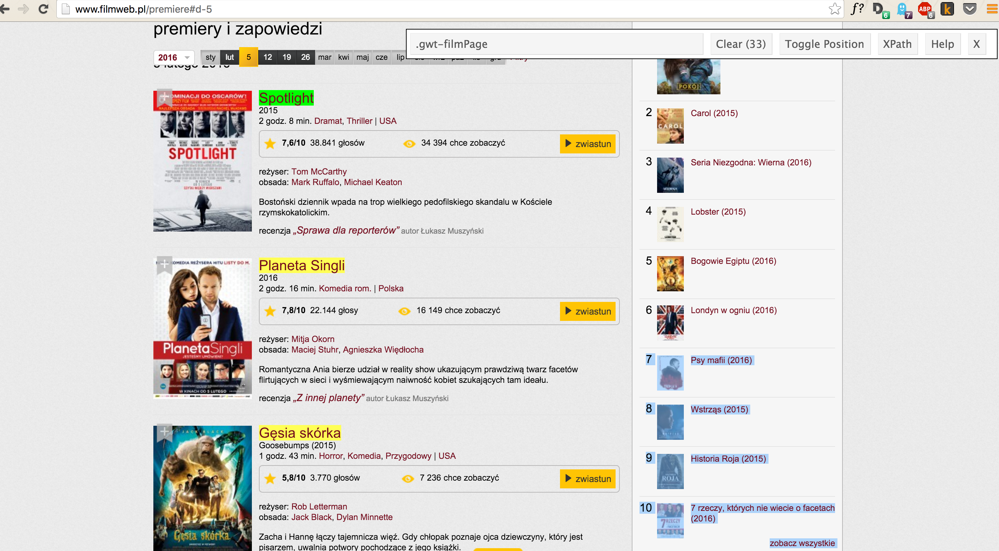

# Jak zeskrobywać dane ze stron www?

Uniwersalnym i wygodnym narzędziem do pobierania danych ze stron internetowych są pakiety `rvest` i `RSelenium`. Przedstawmy je na przykładach.

## Skrobanie HTMLa z użyciem pakietu `rvest`

Kluczowe funkcje z pakietu `rvest` podzielić można na trzy grupy:

* `html` - wczytuje stronę internetową i tworzy strukturę drzewiastą strukturę html,
* `html_nodes` - wyszukuje węzły w drzewie pasujące do określonego wzorca (tzw. selectora),
* `html_text`, `html_tag`, `html_attrs` - funkcje wyciągające treść lub atrybuty węzłów html.

Zazwyczaj praca z pakietem `rvest` rozpoczyna się od wczytania strony HTML, nstępnei wyszukania w tej stornie interesujących fragmentów i wyłuskanie z tych fragmentów tekstu.

Zobaczmy jak te kroki wyglądają na przykładzie pobierania danych o premierach filmów w serwisie FilmWeb. 

Lista premier znajduje się na stornie http://www.filmweb.pl/premiere. Aby poznać wzorce/selektory pozwalające na identyfikacje istotnej treści, najłatwiej jest zainstalować wtyczkę do przeglądarki SelectorGadget http://selectorgadget.com/. Umożliwia ona wybranie myszką interesujących elementów oraz sprawdzenie jaką postać ma selektor pasujący do zaznaczonych opcji.

Na poniższym zdjęciu przedstawiony jest przykład użycia wtyczki SelectorGadget. Zaznaczone na żółto elementy pasują do wzorca CSS `.gwt-filmPage`



Ostatnim krokiem jest wyłuskanie danych z zaznaczonej kolekcji uchwytów. Funkcja `html_text()` wyciąga treść z węzłów HTML.

Poniższy przykład wybiera z serwisu FilmWeb informacje o najbliższych premierach.


```r
library(rvest)
premiery <- html("http://www.filmweb.pl/premiere")
```

```
## Warning: 'html' is deprecated.
## Use 'read_html' instead.
## See help("Deprecated")
```

```r
filmy <- html_nodes(premiery, ".gwt-filmPage")
html_text(filmy)
```

```
##  [1] "Spotlight"                              
##  [2] "Planeta Singli"                         
##  [3] "Gęsia skórka"                           
##  [4] "Ardeny"                                 
##  [5] "Misiek w Nowym Jorku"                   
##  [6] "Umrika"                                 
##  [7] "Śpiewający obrusik"                     
##  [8] "Deadpool"                               
##  [9] "Jak to robią single"                    
## [10] "Widzę, widzę"                           
## [11] "Ojcowie i córki"                        
## [12] "Barany. Islandzka opowieść"             
## [13] "Skala szarości"                         
## [14] "Eisenstein w Meksyku"                   
## [15] "Romeo i Julia"                          
## [16] "Brooklyn"                               
## [17] "Ave, Cezar!"                            
## [18] "Zwierzogród"                            
## [19] "Na granicy"                             
## [20] "Oddychaj"                               
## [21] "Fúsi"                                   
## [22] "Sprawiedliwy"                           
## [23] "Chłopiec i świat"                       
## [24] "Cierń Boga"                             
## [25] "Pokój"                                  
## [26] "Lobster"                                
## [27] "Bogowie Egiptu"                         
## [28] "7 rzeczy, których nie wiecie o facetach"
## [29] "Grimsby"                                
## [30] "Yona"                                   
## [31] "110%"                                   
## [32] "Tysiąc i jedna noc – cz. 1, niespokojny"
## [33] "Dyke Hard"
```

Pakiet `rvest` pozwala też na parsowanie tabel oraz na obsługę formularzy, sesji i śledzenie linków. W poniższym przykładzie otwieramy stronę z bazy danych o filmach IMDb (Internet Movie Database) a informacjami o filmie *Lego Przygoda*.

Następnie trzecia tabela jest wyłuskiwana i wypisywana na ekranie.


```r
lego_movie <- html("http://www.imdb.com/title/tt1490017/")
```

```
## Warning: 'html' is deprecated.
## Use 'read_html' instead.
## See help("Deprecated")
```

```
## Error in open.connection(x, "rb"): Timeout was reached
```

```r
htab <- html_nodes(lego_movie, "table")[[3]]
```

```
## Error in html_nodes(lego_movie, "table"): object 'lego_movie' not found
```

```r
html_table(htab)
```

```
## Error in html_table(htab): object 'htab' not found
```

## Skrobanie HTMLa z użyciem pakietu `RSelenium`

Pakiet `rvest` jest bardzo prosty a jednocześnie pozwala na pobranie wielu danych ze strony. Nie pozwala jednak na utrzymanie sesji i praca ze stroną tak jakby obsługiwał ją interaktywnie człowiek. Do tego typu zadań można użyć biblioteki Selenium dostępnej poprzez pakiet `RSelenium`. 
Biblioteka Selenium po inicjacji otwiera okno przeglądarki a następnie pozwala na wykonywanie określonych operacji na tym oknie.


```r
library(RSelenium)
checkForServer()
startServer()
przegladarka <- remoteDriver$new()
przegladarka$open()
```

Przykładowo funkcją `navigate()` możemy otworzyć w przeglądarce wskazaną stronę internetową. Funkcją `findElement()` możemy odwołać się do elementu na otwartej stornie internetowej. Funkcją `sendKeysToElement()` można zmienić wartość wskazanego elementu oraz wykonać wskazaną akcję, np. przesłać klawisz ENTER. 


```r
przegladarka$navigate("http://www.google.com")

wyszukiwarka <- przegladarka$findElement(using = "name", value = "q")
wyszukiwarka$sendKeysToElement(list("Przewodnik po pakiecie R", key="enter"))

przegladarka$goBack()
```


